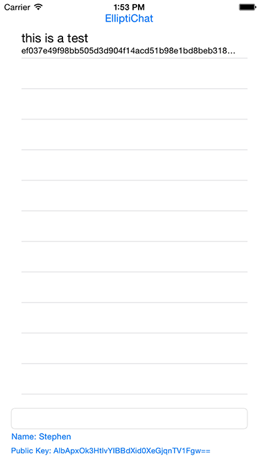
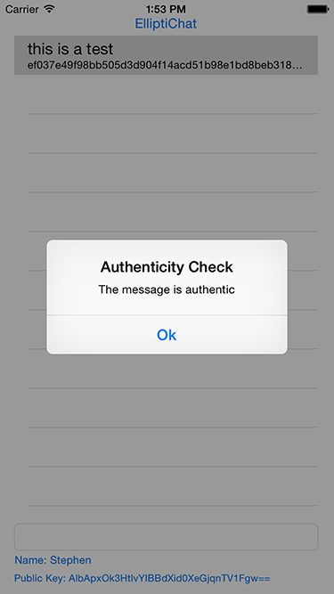

# ElliptiChat

CS 460 SP 15, Stephen Salerno (ssalern2)

ElliptiChat is a proof of concept for user identity verification over unsecure chat. It uses elliptic curve cryptography through ECDSA and the easy-ecc library (wrapped in Objective-C) to sign. A user (or yourself) each have unique and secret private keys, and unique but known public keys. When a message is sent, it's stored in the chat log, along with it's signature. The signature is computed by hashing the message, and then signing the hashed message.

Data signed with ECDSA need to be a fixed length, so the message sent is first hashed using the SHA-256 algorithm, where the right-most bits are truncated if necessary. The data is then signed using ECDSA, with the Secp192r1 elliptic curve, and public and private keys generated for that curve at runtime for every session.

The private key for the user's session is displayed at the bottom. The hashed and signed data for that message is displayed in the subtitle.

Messages can be checked for authenticity, by comparing the signed data with the public key corresponding to the same Secp192r1 curve.  THis allows you to check if the message is actually written by a specific user, without having to know their private key.

Project requires Xcode 6.3, and targets iOS 8.3.